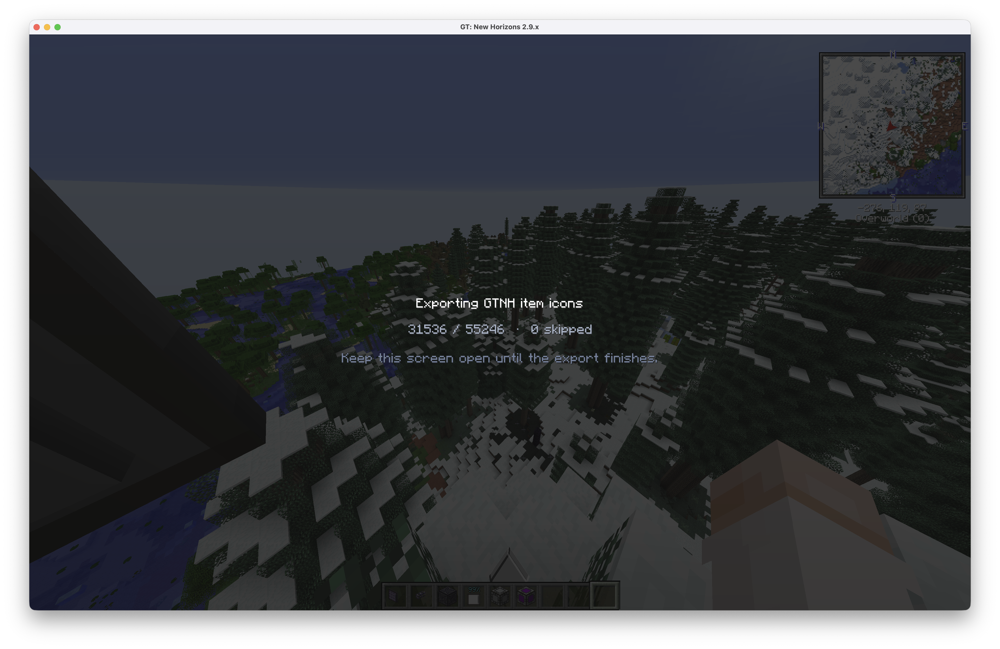

# AE2 Terminal

[](https://github.com/fopwoc/ae2-custom-web/actions/workflows/ci.yml)

A modern, mobile-friendly web terminal for [AE2 Web Integration](https://github.com/kuba6000/AE2-Web-Integration). It keeps the mod API behind a typed SvelteKit server proxy, owns browser login sessions, and presents inventory, craft planning, crafting CPUs, and tracked activity without exposing the upstream service publicly.

> [!NOTE]
> This project contains AI-generated code. See [AI_USAGE.md](AI_USAGE.md) for details.

```text
Browser → HTTPS Caddy → 127.0.0.1:2325 → AE2 Terminal → http://gtnh:2324 → AE2 Web Integration
```

## Features

- Searchable AE2-style grid/list inventory with stored/craftable filters and compact mobile layouts
- Stock GTNH 2.9.0 beta 2 item icons in the image, with custom resource-pack overrides and safe namespace fallbacks
- Craft simulation, missing-material review, CPU selection, and submission
- Crafting CPU capacity, ingredients, job state, and guarded cancellation
- Crafting history, timing detail, and per-network tracking controls
- HttpOnly, `Secure`, `SameSite=Strict` session cookie; the upstream bearer token is never available to client JavaScript
- Runtime validation of every upstream response through the reusable `@ae2-terminal/ae2-api` package

## Run with Docker Compose

1. Install AE2 Web Integration on the Minecraft server and verify it responds at `http://gtnh:2324` from the Docker network.
2. Leave the default local image name when building, or set `IMAGE=ghcr.io/<owner>/ae2-terminal:<version>` after publishing.
3. Copy `.env.example` to `.env` and adjust the upstream URL if necessary.
4. Start the service:

   ```sh
   docker compose up --build -d
   ```

5. Copy `deploy/Caddyfile.example` into the homelab Caddy configuration and replace `ae2.example.com` with the real HTTPS hostname.

The image includes the default GTNH 2.9.0 beta 2 icon pack, so the basic Compose deployment needs no additional icon files. The Compose port is deliberately bound to `127.0.0.1:2325`; only Caddy should expose the terminal. Set `PUBLIC_MODE=true` only when players should be able to register their own accounts. Registration still requires the corresponding Minecraft player to be online.

## Custom resource-pack icons

Use the bundled base pack when playing with the stock resources.

### Icon exporter mod

The repository includes a client-only Forge mod for GTNH 1.7.10 under `mods/icon-exporter/`. It reads the item variants resolved by NEI and renders them through the running Minecraft client, so the exported icons reflect the installed mods and active resource packs. The resulting pack contains content-addressed PNG files plus a `manifest.json` that maps AE2 item identities to those files. Nothing needs to be installed on the Minecraft server.



The export runs incrementally on its own progress screen. Keep that screen open until Minecraft reports completion in chat; closing it interrupts the export.

### Export a custom pack

1. Build the exporter with Java 25:

   ```sh
   ./mods/icon-exporter/gradlew -p mods/icon-exporter build
   ```

2. Copy the resulting jar without a `-dev` or `-sources` suffix from `mods/icon-exporter/build/libs/` into the GTNH client's `mods/` directory.
3. Join the server, wait for NEI to finish loading, then run:

   ```text
   /exporticons homelab
   ```

4. Copy the generated client directory `ae2-icons/homelab/` to this repository as `./ae2-icons/` so `./ae2-icons/manifest.json` exists.
5. Start Compose with the custom-pack override:

   ```sh
   docker compose -f compose.yaml -f compose.custom-icons.yaml up --build -d
   ```

Exports are immutable snapshots. Re-export after changing the modpack or resource packs. Failed renders are recorded in `manifest.json` and the UI falls back per item. The current AE2 Web Integration response identifies items as `registry:damage`; if multiple exported NBT variants share that legacy ID, the first deterministic entry is used.

Custom exports under `./ae2-icons/` are intentionally ignored by Git. The versioned stock archive embedded in the image lives under `assets/icon-packs/`.

## Local development

Requires Node.js 26 and pnpm 11.

```sh
npm install --global pnpm@11.19.0
pnpm install
VERSION=0.0.0-dev pnpm dev
```

The development server listens on `http://localhost:5173`. `UPSTREAM_URL` defaults to `http://gtnh:2324`.

Useful checks:

```sh
VERSION=0.0.0-test pnpm check
VERSION=0.0.0-test pnpm test
VERSION=0.0.0-test pnpm build
pnpm format:check
```

## Repository layout

```text
apps/terminal/       SvelteKit UI and authenticated BFF
packages/ae2-api/    Typed AE2 Web Integration client and contracts
packages/icon-manifest/ Versioned icon-pack schema and lookup
mods/icon-exporter/  Client-only GTNH 1.7.10 icon exporter
assets/icon-packs/   Versioned stock icon pack embedded in the image
deploy/              Reverse-proxy examples
scripts/             Source-control-derived build version tooling
```

## Configuration

| Variable         | Default            | Purpose                                                     |
| ---------------- | ------------------ | ----------------------------------------------------------- |
| `UPSTREAM_URL`   | `http://gtnh:2324` | Internal AE2 Web Integration base URL                       |
| `PUBLIC_MODE`    | `false`            | Enables player registration                                 |
| `COOKIE_SECURE`  | `true` in Compose  | Requires HTTPS; use `false` only for local HTTP development |
| `ICON_PACK_PATH` | `./ae2-icons`      | Host path used by `compose.custom-icons.yaml`               |
| `ICON_PACK_DIR`  | `/app/icon-pack`   | Runtime pack directory; custom Compose uses `/data/icons`   |
| `LOG_LEVEL`      | `error`            | `debug`, `info`, `warn`, or `error`                         |
| `PORT`           | `3000`             | Container HTTP port                                         |
| `VERSION`        | Git-derived        | Explicit build identity for non-Git builds                  |

Tagged builds use exact semantic tags such as `1.2.3`. Untagged Git builds use `<commit-date>-<short-hash>`.

## Compatibility

The client contracts target the HTTP behavior of AE2 Web Integration’s GTNH 1.7.10 branch at commit `e44385d65619dac04381f0d51ae2c3e2bd9b2002`. A contract mismatch is surfaced as a server error instead of silently rendering incorrect state.

## License

This project uses the WTFNMFPL. See [LICENSE](LICENSE), [COPYRIGHT](COPYRIGHT), and [THIRD_PARTY.md](THIRD_PARTY.md).
